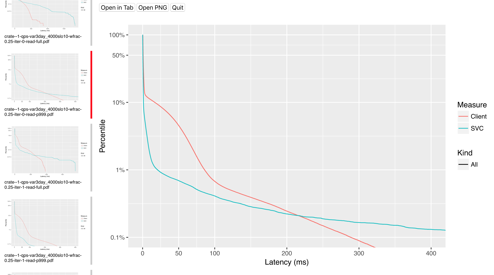

# vplots

vplots is a tool to view plots. I made it after being fed up with Preview. For now, vplots only handles pdf files.

## Dependencies

* [ImageMagick](https://www.imagemagick.org/script/index.php)
* [pdf2svg](http://www.cityinthesky.co.uk/opensource/pdf2svg)

Both are available in homebrew.

## Screenshot

